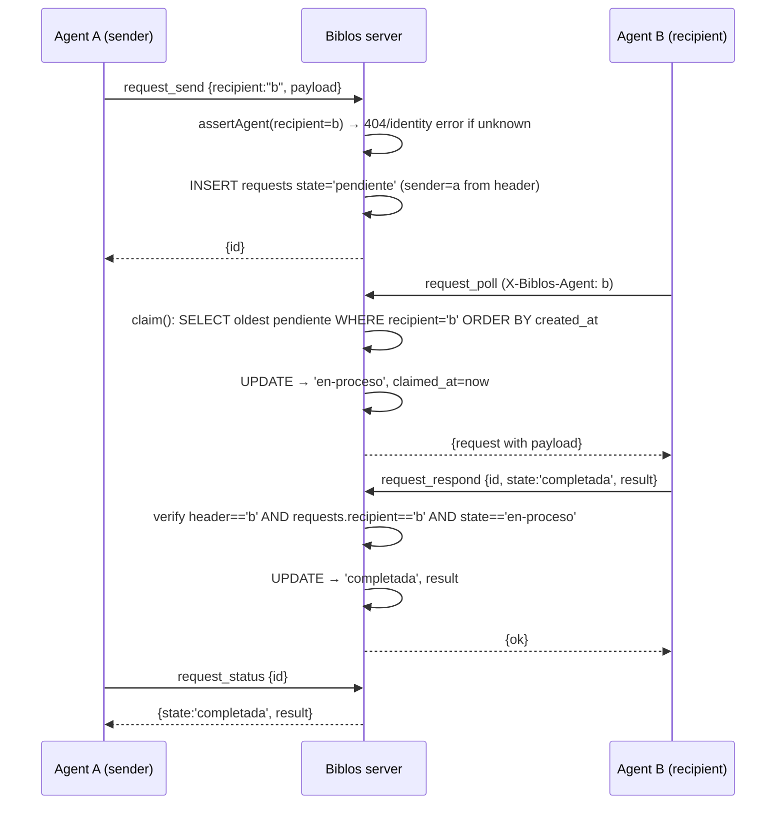

# Design: Biblos MCP Core

## Technical Approach

Greenfield TypeScript package on Node 22. A stateless `McpServer` (`@modelcontextprotocol/sdk@1.30.0`, Streamable HTTP) on `127.0.0.1:8199` exposes 14 tools across five domains. Layered: HTTP transport + auth middleware → domain services (`documents`, `graph`, `bus`, `registry`) → single SQLite store (`better-sqlite3` + `sqlite-vec` + FTS5). Embeddings cross an explicit HTTP boundary to the llama.cpp router (`127.0.0.1:8085`, `nomic-embed-text-v1.5.Q8_0`, 768d); the server never reasons with an LLM in v1. Maps proposal approach (REQ-001..017); one deviation noted in D2.

## Architecture Decisions

| # | Decision | Options (tradeoffs) | Choice |
|---|----------|--------------------|--------|
| D1 | SDK line | v2 modular (newer, Hono/zod4, less sample surface) vs **v1 monolith 1.30.0** (battle-tested, one dep) | v1 monolith (per exploration rec.) |
| D2 | Persistence | MongoDB+Qdrant (exploration rec.; infra exists) vs **SQLite single file** (`/opt/biblos/biblos.db`, sqlite-vec+FTS5, zero infra, sync API, transactional) | **SQLite** — closed product decision; overrides exploration; FTS5 + vec0 in one file satisfies REQ-017 |
| D3 | Transport mode | Session-aware vs **stateless** (no `MCP-Session-Id`) | Stateless — trivial Apache proxy, no affinity (exploration) |
| D4 | Agent identity | Payload field (pollutes 14 zod schemas; forgeable by caller) vs **`X-Biblos-Agent` header** verified at HTTP boundary | **Header** — see Security |
| D5 | Fusion | RRF (rank-based, weight not natural) vs **normalized weighted sum** (w defaults 0.5, per REQ-memory-search) | Weighted sum; both scores bounded [0,1] |
| D6 | Embedding write order | write-then-embed (partial rows on failure) vs **embed-then-transaction** (embed first, then atomic INSERT doc+fts+vec) | Embed-first — REQ-core-embeddings "no partial write" |
| D7 | Vector store | brute-force in-app vs **sqlite-vec `vec0`** | vec0 — SQL FTS+vector in one DB |

## Architecture (layers)

```
Clients (OpenClaw/OpenCode) ──HTTPS──▶ Apache vhost (biblos.coltmandev.dev)
                                          │ ProxyPass / → 127.0.0.1:8199
                                          ▼
                    ┌───────────────────────────────┐   systemd: biblos.service
                    │  src/index.ts  (Node http)   │
                    │  ┌─────────────────────────┐ │
                    │  │ auth.ts  Origin→403     │ │  ← Bearer→401, timing-safe
                    │  │          Bearer→401     │ │
                    │  └───────────┬─────────────┘ │
                    │              ▼              │
                    │  McpServer (StreamableHTTP) │
                    │   server/tools.ts (14 zod)  │
                    │              │              │
                    │   domain/ documents·graph·bus·registry
                    │              │              │
                    │   hybrid/fusion.ts          │
                    └──────┬───────────┬──────────┘
                           │           │  HTTP (fetch)
                     SQLite db      embeddings/client.ts
              /opt/biblos/biblos.db       │  POST 127.0.0.1:8085/v1/embeddings
              (better-sqlite3, WAL)       ▼
                                    llama router (nomic-embed 768d)
```

In-process logic vs llama.cpp boundary: all router interaction is confined to `embeddings/client.ts` (fetch + normalize + timeout); domain services depend on an `EmbeddingClient` interface, so tests mock at that seam.

## SQLite Schema (`src/db/schema.sql`, applied on boot via `migrate()`)

```sql
PRAGMA journal_mode=WAL; PRAGMA foreign_keys=ON; PRAGMA busy_timeout=5000;

CREATE TABLE documents (
  rowid    INTEGER PRIMARY KEY AUTOINCREMENT,   -- FTS5 external-content rowid
  id       TEXT NOT NULL UNIQUE,                -- uuid v4, public API id
  content  TEXT NOT NULL CHECK(length(content) > 0),
  author   TEXT NOT NULL,
  created_at TEXT NOT NULL DEFAULT (strftime('%Y-%m-%dT%H:%M:%fZ','now')),
  updated_at TEXT NOT NULL DEFAULT (strftime('%Y-%m-%dT%H:%M:%fZ','now')),
  tags     TEXT NOT NULL DEFAULT '[]',          -- JSON array
  project  TEXT,
  type     TEXT NOT NULL DEFAULT 'note'
);
CREATE INDEX idx_docs_project ON documents(project);

CREATE VIRTUAL TABLE documents_fts USING fts5(
  content, tags, content='documents', content_rowid='rowid');
-- triggers: AFTER INSERT/UPDATE/DELETE keep documents_fts in sync

CREATE VIRTUAL TABLE document_embeddings USING vec0(
  rowid INTEGER PRIMARY KEY, embedding float[768]);

CREATE TABLE relations (
  id INTEGER PRIMARY KEY AUTOINCREMENT,
  source_id TEXT NOT NULL REFERENCES documents(id) ON DELETE CASCADE,
  type      TEXT NOT NULL,
  target_id TEXT NOT NULL REFERENCES documents(id) ON DELETE CASCADE,
  created_at TEXT NOT NULL DEFAULT (strftime('%Y-%m-%dT%H:%M:%fZ','now')),
  UNIQUE(source_id, type, target_id)
);

CREATE TABLE agents (
  name         TEXT PRIMARY KEY,                -- unique identity (REQ-registry)
  type         TEXT NOT NULL,
  capabilities TEXT NOT NULL,                   -- JSON array
  created_at   TEXT NOT NULL DEFAULT (strftime('%Y-%m-%dT%H:%M:%fZ','now'))
);

CREATE TABLE requests (
  id         TEXT PRIMARY KEY,                  -- uuid v4
  sender     TEXT NOT NULL REFERENCES agents(name),
  recipient  TEXT NOT NULL REFERENCES agents(name),
  payload    TEXT NOT NULL,                     -- JSON
  state      TEXT NOT NULL CHECK(state IN ('pendiente','en-proceso','completada','fallida')),
  result     TEXT,                              -- JSON (completada result | fallida error)
  created_at TEXT NOT NULL DEFAULT (strftime('%Y-%m-%dT%H:%M:%fZ','now')),
  claimed_at TEXT,
  updated_at TEXT NOT NULL DEFAULT (strftime('%Y-%m-%dT%H:%M:%fZ','now'))
);
CREATE INDEX idx_requests_recipient_state ON requests(recipient, state, created_at);
```

Tag filter (`list_documents`): `WHERE EXISTS (SELECT 1 FROM json_each(documents.tags) WHERE value = ?)`.

## Interfaces / Contracts

```typescript
// src/domain/types.ts
interface DocumentRecord { id: string; content: string; author: string;
  createdAt: string; updatedAt: string; tags: string[]; project?: string; type: string }
interface Relation { sourceId: string; type: string; targetId: string }
type RequestState = 'pendiente' | 'en-proceso' | 'completada' | 'fallida';
interface BusRequest { id: string; sender: string; recipient: string; payload: unknown;
  state: RequestState; result?: unknown; createdAt: string }
interface AgentRecord { name: string; type: string; capabilities: string[]; createdAt: string }
interface SearchHit { document: DocumentRecord; score: number; matchedBy: 'semantic'|'fts'|'both' }

// src/embeddings/client.ts — the ONLY llama-boundary seam
interface EmbeddingClient { embed(text: string): Promise<number[]> } // normalized 768d

// src/db/store.ts — sync facade over better-sqlite3 (single connection)
interface Store {
  insertDocument(d: DocumentRecord, embedding: number[]): void;   // one txn: docs+fts+vec
  updateDocument(id: string, patch: Partial<DocumentRecord>, reembed?: number[]): void;
  deleteDocument(id: string): void;                                // txn: docs+fts+vec+relations
  getDocument(id: string): DocumentRecord | null;
  listDocuments(f: {project?: string; tags?: string[]; limit: number; offset: number}): DocumentRecord[];
  vectorSearch(embedding: number[], k: number): Array<{rowid: number; distance: number}>;
  ftsSearch(q: string, k: number): Array<{rowid: number; bm25: number}>;
  addRelation(r: Relation): void;  removeRelation(r: Relation): void;
  queryGraph(start: string, type?: string, depth: number): {nodes: string[]; edges: Relation[]};
  registerAgent(a: AgentRecord): void;  assertAgent(name: string): void;
  enqueue(r: BusRequest): void;
  claim(recipient: string): BusRequest | null;   // oldest pendiente for recipient → en-proceso
  respond(id: string, r: {state: 'completada'|'fallida'; result: unknown}, recipient: string): void;
  status(id: string): BusRequest | null;
}
```

## Tool Flows (JSON-RPC)

All tool calls arrive as `{"jsonrpc":"2.0","method":"tools/call","params":{"name":...,"arguments":{...}},"id":1}`; replies are `{"jsonrpc":"2.0","id":1,"result":{"content":[{"type":"text","text":"<json>"}],"isError":false}}`. Identity comes from the `X-Biblos-Agent` header, never from `arguments`.



Identity checks: `request_poll` filters `WHERE recipient = header` (foreign poll → empty result, state untouched); `request_respond` fails hard (identity error) if `header ≠ recipient` or state ∉ {en-proceso}. `request_send` requires sender registered (REQ-registry).

Search flow: `search_documents {query, limit, fusion_weight?}` → embed(query) → `vec0` kNN (k=50) + FTS5 (k=50) → `hybrid/fusion.ts` merge → top `limit` (default 10, max 100).

## Hybrid Fusion (`src/hybrid/fusion.ts`)

- `semantic_score = max(0, 1 − distance²/2)` — cosine for normalized vectors from vec0 squared-euclidean `distance`.
- `fts_score = 1 / (1 + |bm25|)` — bounded, monotonic per row (no cross-query min-max).
- `merged = w·semantic + (1−w)·fts`, `w = BIBLOS_FUSION_WEIGHT` (default `0.5`), optionally overridden by tool param, clamped [0,1].
- Union of k=50 candidates per source; drop hits with `merged < BIBLOS_MIN_SCORE` (default `0`); empty both → `[]`.

## Error Handling

| Source | Behavior |
|--------|----------|
| Embedding router | `fetch` with connect timeout 3s / total 10s (`AbortSignal.timeout`); 1 retry; failure → tool result `isError:true` (e.g. `embedding_service_unavailable`); save path never writes (embed-first, D6) |
| SQLite | better-sqlite3 sync; every multi-statement op in `try/catch` + `rollback()`; `SQLITE_BUSY/LOCKED` → surfaced error; never swallow; corrupt file → 500 tool error (REQ-core-persistence) |
| MCP protocol | `-32602` invalid params (zod), `-32601` unknown method; not-found/identity/state errors → `isError:true` tool results with descriptive text (per spec scenarios) |
| Transport | 401 bad key, 403 bad Origin (plain HTTP, per MCP 2025-11-25), 405 non-POST, 404 unknown |

## Security

- **Middleware order** (`src/auth.ts`): (1) `Origin` not in `BIBLOS_ALLOWED_ORIGINS` (or missing on non-GET) → **403**; (2) Bearer key mismatch via `crypto.timingSafeEqual` → **401**; then handler. Applies to every request (REQ-core-auth).
- **Agent identity — chosen: `X-Biblos-Agent` header.** Rejected alternative: identity in tool `arguments` — it would be settable per-call by the caller (spoofing the recipient checks), pollute all 14 zod schemas, and duplicate a fact the transport already knows. The header is checked once at the HTTP boundary, keeps tool schemas declarative, and both clients can send it (OpenCode `headers`, OpenClaw secret store). Trust domain: header is as trustworthy as the API key holder — the same bearer that can register/act on behalf of an agent. Registry tools create the identity that bus tools enforce.
- **systemd hardening**: `User=biblos`, `ProtectSystem=strict`, `ReadWritePaths=/opt/biblos`, `PrivateTmp`, `NoNewPrivileges`, `CapabilityBoundingSet=`, `RestrictAddressFamilies=AF_INET AF_UNIX`.

## Configuration & Deployment

Package: `package.json` (engines `node >=22`), `tsconfig.json` (ES2022, NodeNext), `vitest.config.ts`, `src/`, `tests/`, `docs/clients.md`, `deploy/`. Env (`.env.example`):

| Var | Default | Purpose |
|-----|---------|---------|
| `BIBLOS_API_KEY` | — (required) | Bearer auth |
| `BIBLOS_ALLOWED_ORIGINS` | — (required) | Origin allowlist → 403 |
| `ROUTER_URL` | `http://127.0.0.1:8085` | llama router base |
| `DB_PATH` | `/opt/biblos/biblos.db` | SQLite file |
| `BIBLOS_HOST` / `BIBLOS_PORT` | `127.0.0.1` / `8199` | bind |
| `BIBLOS_EMBED_MODEL` | `nomic-embed-text-v1.5.Q8_0` | router model |
| `BIBLOS_FUSION_WEIGHT` | `0.5` | hybrid weight |
| `BIBLOS_EMBED_TIMEOUT_MS` | `10000` | router timeout |

Deploy (`deploy/biblos.service`): `ExecStart=/usr/bin/node /opt/biblos/dist/index.js`, `EnvironmentFile=/etc/biblos/biblos.env`, `Restart=always`. Apache: copy `openclaw.conf` pattern — vhost `biblos.coltmandev.dev`, `ProxyPreserveHost On`, `ProxyPass / http://127.0.0.1:8199/`; steps: (1) Cloudflare A record → the server's public IP, (2) `certbot --apache -d biblos.coltmandev.dev`, (3) enable vhost, `apachectl reload`. **sqlite-vec note**: prefer the prebuilt binary matching Node 22 (ABI 115, linux-x64); if absent, `node-gyp` build needs `build-essential` + `python3` on the VPS — verify in apply before relying on prebuilds. WAL checkpoint + file copy = backup; `systemctl stop biblos` = rollback (data intact).

## Testing Strategy (vitest)

| Layer | What | Approach |
|-------|------|----------|
| Unit | fusion math, registry uniqueness, bus state machine, embedding L2-normalize | pure functions; fake `Store`; golden score cases |
| Unit | `EmbeddingClient` timeout/retry/normalize | mock global `fetch` (reject/resolve) |
| Integration | 14 tools through `McpServer` + `StreamableHTTPServerTransport` on ephemeral port, temp DB file | real SQLite + mocked router via `fetch` stub (MSW-style) |
| Integration | auth middleware 401/403/200; identity header enforcement on bus tools | raw HTTP POSTs with/without headers |
| E2E | two-agent bus roundtrip (send→poll→respond→status) over real HTTP; restart persistence | spawn `dist/index.js` with temp env; `StreamableHTTPClientTransport` |
| E2E | hybrid search returns semantic + keyword hits | real corpus fixture; router mock returns fixed vectors |

Router is never required in tests — always mocked at the `fetch` seam (D6 keeps it out of critical write paths).

## Threat Matrix

`N/A` — no routing, shell commands, subprocesses, VCS/PR automation, executable-file classification, or process-integration boundary. The server is in-process HTTP + SQLite logic; its only external call is a data fetch to the embedding router (not command execution). No RED shell tests needed.

## Migration / Rollout

No migration (greenfield). Rollout: loopback smoke → A record + certbot → vhost + client docs (REQ-core-client-docs); live OpenClaw/OpenCode activation deferred per proposal.

## Open Questions

- [ ] Confirm llama router `/v1/embeddings` request shape (`input` string vs array; response `data[].embedding`) — verify with a curl during apply.
- [ ] Decide if `request_status` and `get_document` require the caller to be registered (spec silent) — default: no, auth via API key only.
- [ ] `BIBLOS_ALLOWED_ORIGINS` default for CLI clients that send no Origin — must be explicitly configured (403 if absent); confirm list with client UAs.
